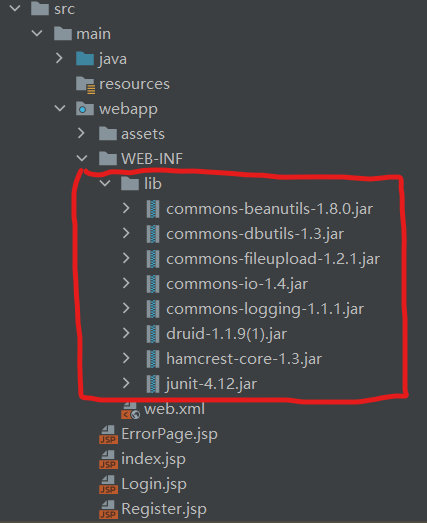
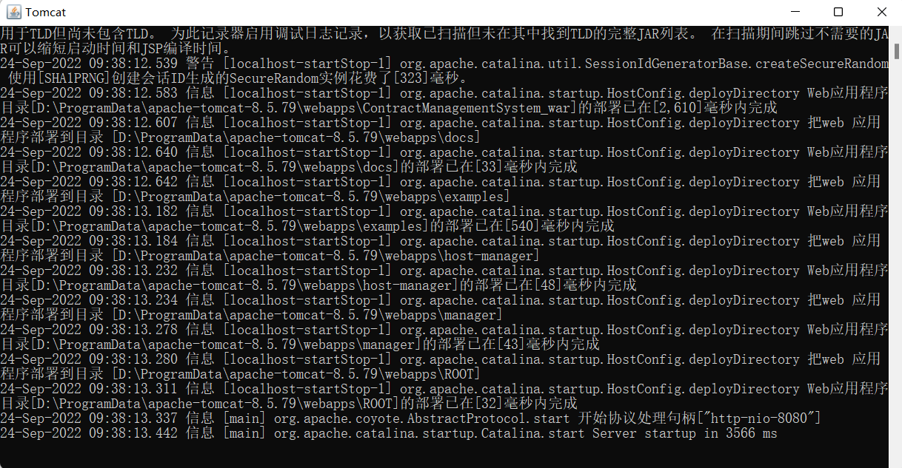
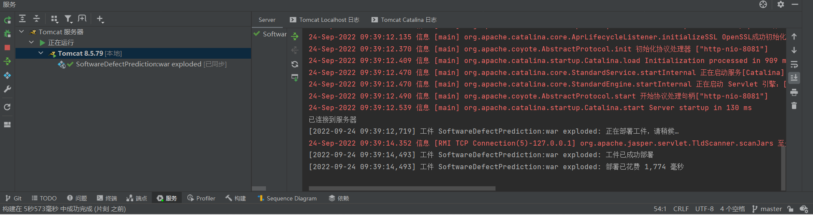

# Software Defect Prediction

#### 介绍
**以下是软件缺陷预测项目简介**


#### 软件架构
软件架构说明：
- 采用JavaWeb，MVC框架


#### 目录结构描述
````
|————SoftwareDefectPrediction
|————   .idea
|   |————...
|————   lib
|   |————...
|————   src
|   |————...
|————   target
|   |————...
|————   .gitignore
|————   LICENSE
|————   pom.xml
|————   README.md
|————外部库
|   |————...
|————临时文件和控制台
|   |————...

````


#### 注意
1. 
2. 
3. 


#### 安装教程

1. 最好使用idea专业版
2. 确保所用到的包已导入lib

3. 确保配置正确


#### 使用说明

1. 先运行Tomcat，再打开网页界面
  


2.  

#### 参与贡献

1.  组长：祁麟
2.  客户端、服务端工程师：梁子煜、马佳颖
3.  算法：祁麟、林千琬、张启洋

#### 部分截图
- 注册登录